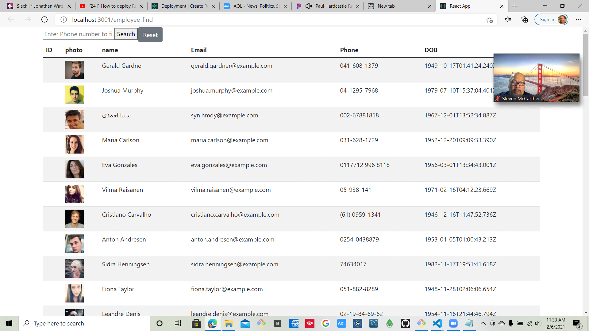
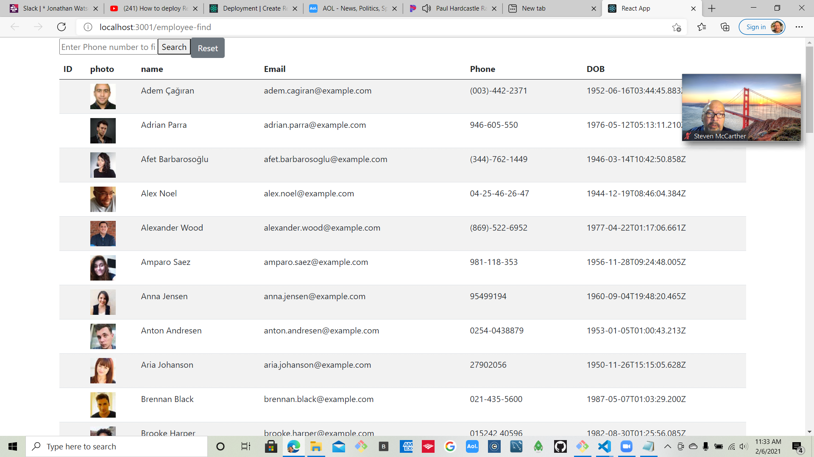
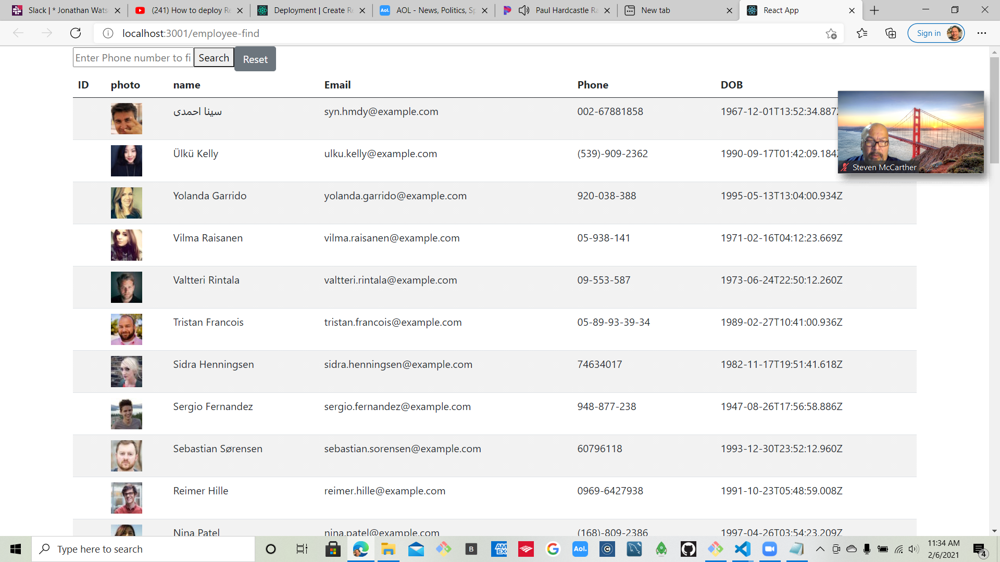
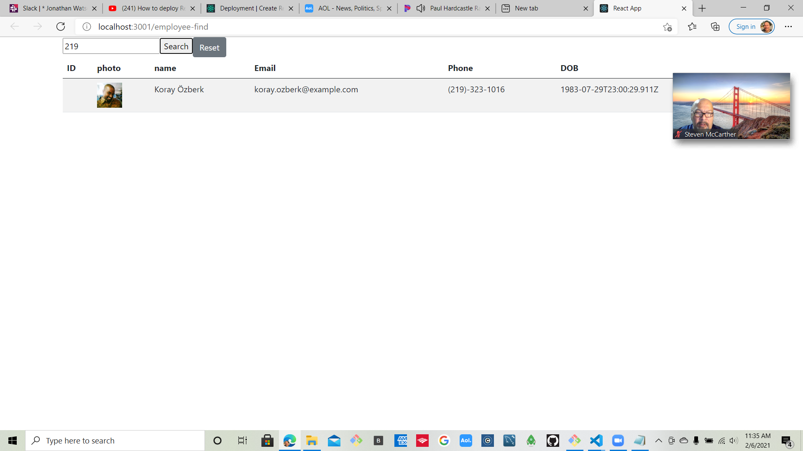

                      USER DIRECTORY
                      --------------

Objective

---

Create an Employee Directory using Components State tha responds to User Events , e.g. Sort / Filter .

## Software Used

REACT / AXIOS

The application base was a REACT app that would display a list of employees from a user site where certain information would be listed for each person , e.g., name , date of birth , phone , etc and the user would be able to manipulate the information using sorting / filtering options based on name / phone number . The " sort " routine would give the user the option of Ascending / Descending order and the filter option was applied to the the phone information where employees were displayed based on a similar phone e.g. "583" .

## SCREENSHOTS

## startup page

## Ascending Order results

## Descending Order results

## Filter Display

## Functionality

Once the website is displayed :

a) Ascending Order - click on "name" column to sort in ascending order
b) Descending Order - click on " name " column a second time to display in descending order
c) Filter - Enter phone number from one of the listed employees in " search " box to display
that user plus any other user with that same number
